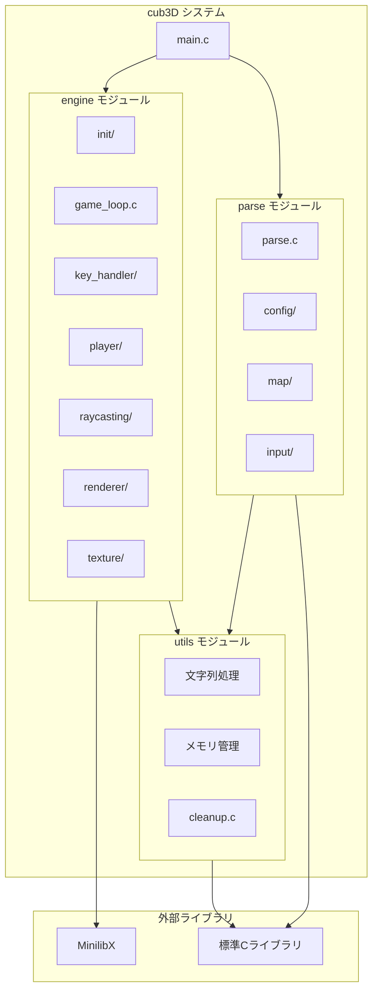
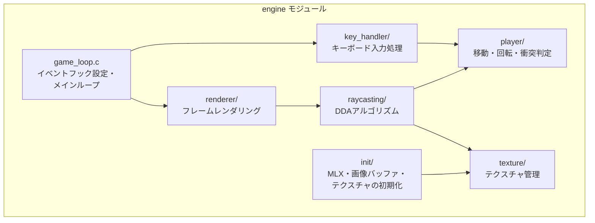
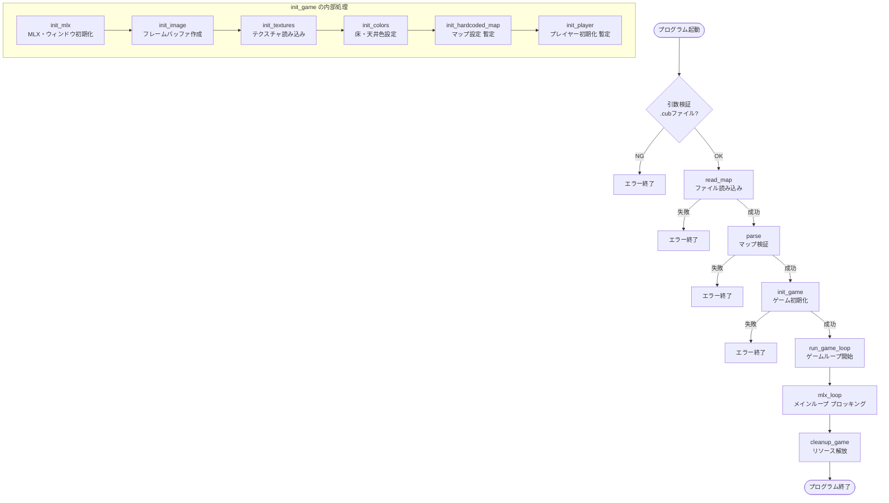
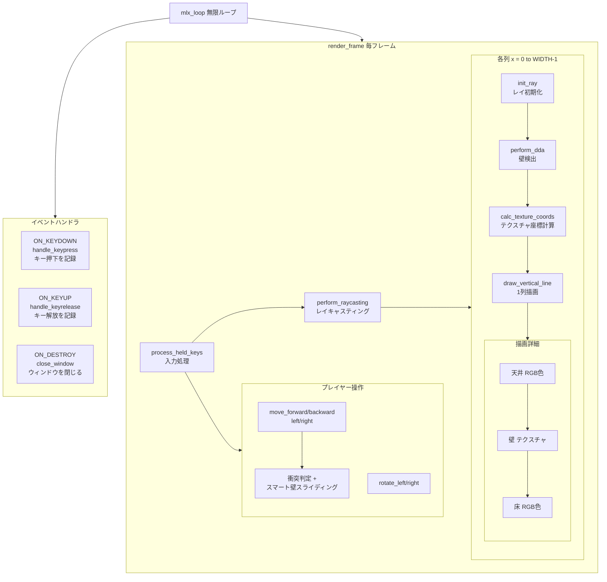
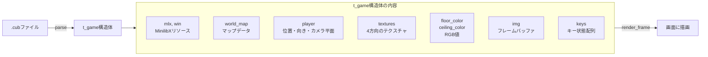
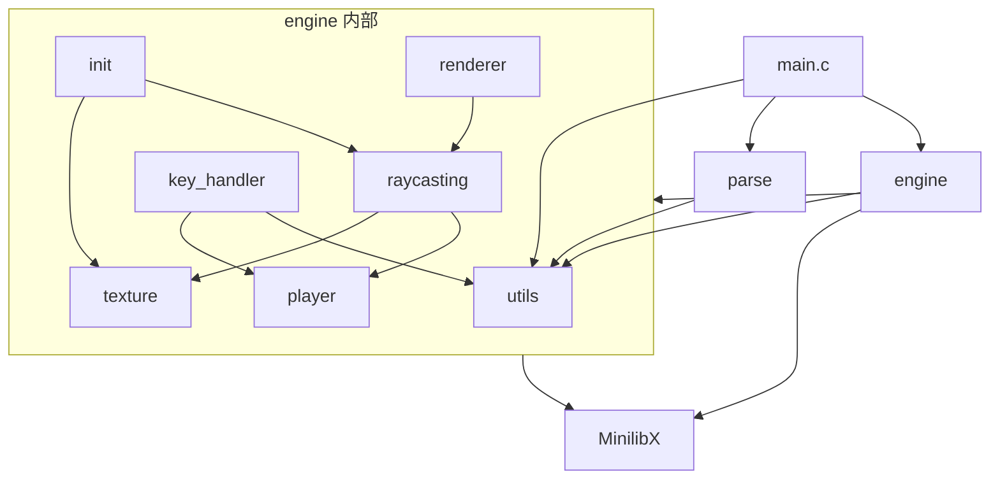
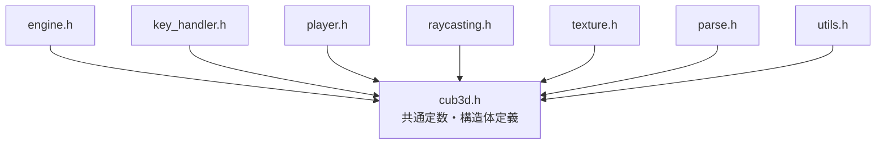

# アーキテクチャ設計

## システム構成図

## モジュール構成

### engine

**目的:** ゲームエンジンの制御とレンダリング

**主な機能:**
- MinilibXの初期化とウィンドウ管理
- ゲームループの実行
- キーボード入力処理
- プレイヤーの移動・回転・衝突判定
- レイキャスティングによる3D描画
- テクスチャマッピング
- フレームバッファへの描画

**サブモジュール構成:**

**実装状況:**
- ✅ 完全実装済み（テクスチャマッピング、スマート壁スライディング含む）
- ⏳ パーサー統合待ち（ハードコードされたマップデータを使用中）

### parse

**目的:** .cubファイルの読み込みと検証

**主な機能:**
- .cubファイルの読み込み
- マップデータの検証
- テクスチャパスの抽出
- 床・天井色の抽出
- プレイヤー初期位置の検出
- エラーチェック（不正なマップ、欠損データなど）

**サブモジュール:**
- `config/`: テクスチャパス、色の設定処理
- `map/`: マップデータの検証
- `input/`: ファイル入力処理

**実装状況:**
- ⏳ パートナー担当、進行中
- 現在はプレースホルダーとして基本的な`parse()`関数のみ実装

### utils

**目的:** 汎用ユーティリティ関数とメモリ管理

**主な機能:**
- 文字列操作（`ft_strlen`, `ft_strcmp`, `ft_strncmp`, `ft_strndup`）
- メモリ管理（`free_map`）
- ファイル読み込み（`read_map`）
- クリーンアップ処理（`cleanup_game`）

**実装ファイル:**
- `ft_strlen.c`: 文字列長を取得
- `ft_strcmp.c`: 文字列比較
- `ft_strncmp.c`: 文字列比較（n文字）
- `ft_strndup.c`: 文字列複製
- `free_map.c`: マップメモリの解放
- `read_map.c`: .cubファイルの読み込み
- `cleanup.c`: ゲーム終了時のクリーンアップ

**実装状況:**
- ✅ 基本的なユーティリティは実装済み
- ⏳ パーサー統合時に追加のユーティリティが必要になる可能性あり

## データフロー

### 起動時のフロー

### ゲームループのフロー

### データ構造の流れ

## 依存関係

### モジュール間の依存関係

| モジュール | 依存先 | 理由 |
|-----------|--------|------|
| **main.c** | parse, engine, utils | マップ読み込み、パース、ゲーム実行、クリーンアップ |
| **engine** | utils, MinilibX | ユーティリティ関数、グラフィックス描画 |
| **engine/init** | texture, raycasting | テクスチャ初期化、マップ・プレイヤー初期化 |
| **engine/renderer** | raycasting | レイキャスティングによる描画 |
| **engine/raycasting** | texture, player | テクスチャサンプリング、プレイヤー情報 |
| **engine/player** | なし | 独立したモジュール |
| **engine/key_handler** | player, utils | プレイヤー操作、クリーンアップ |
| **engine/texture** | MinilibX | XPMファイルの読み込み |
| **parse** | utils | 文字列処理、メモリ管理 |
| **utils** | なし | 独立したモジュール |

### ヘッダーファイルの依存関係

## 設計原則

### 1. 関心の分離 (Separation of Concerns)

各モジュールは明確な責務を持ち、他のモジュールの実装詳細を知らない：
- **parse**: ファイル読み込みと検証のみ
- **engine**: ゲームループとレンダリングのみ
- **utils**: 汎用的なユーティリティのみ

### 2. 単一責任原則 (Single Responsibility Principle)

各関数は1つの明確な責務のみを持つ：
- `init_game()`: 初期化のみ
- `run_game_loop()`: ループ管理のみ
- `render_frame()`: レンダリングのみ
- `move_forward()`: 前進のみ

### 3. 依存性逆転の原則 (Dependency Inversion Principle)

上位モジュールは下位モジュールの詳細を知らず、公開インターフェースのみを使用：
- `main.c` は `init_game()`, `run_game_loop()` を呼ぶだけ
- イベントフックの設定方法は `engine` 内部で完結

### 4. カプセル化

内部実装は static 関数として隠蔽：
- `init_mlx()`, `init_image()` は `init_game.c` 内の static 関数
- `platform_close()` は `key_handler.c` 内の static 関数

### 5. モジュール化

機能ごとにサブモジュールを分割：
- `player/`: プレイヤー操作（移動、回転）
- `raycasting/`: レイキャスティングアルゴリズム
- `texture/`: テクスチャ管理

### 6. エラーハンドリング

エラーは適切に検出・報告・処理される：
- 初期化失敗時は戻り値でエラーを通知
- エラーメッセージは標準エラー出力に書き込み
- リソース解放は必ず実行（NULLチェック付き）

### 7. クロスプラットフォーム対応

macOS と Linux の両方で動作するよう、プラットフォーム固有の処理は条件分岐：
- `#ifdef __linux__` による条件コンパイル
- `mlx_destroy_display()` の有無
- キーコードの違い

## 制約事項

### 技術的制約

1. **42 Norminette 準拠**
   - 1関数25行以内
   - 1行80文字以内
   - 5関数以内/ファイル
   - ネストの深さ制限
   - 命名規則の遵守

2. **使用可能な外部関数**
   - MinilibX の関数群
   - 標準Cライブラリ（open, read, write, malloc, free, close, exit など）
   - 数学ライブラリ（sin, cos など）

3. **メモリ管理**
   - すべての動的メモリは必ず解放
   - メモリリークは許容されない
   - Valgrindでのチェック必須

4. **ファイル構成**
   - Makefileによるビルド
   - .cと.hの分離
   - includesディレクトリとsrcsディレクトリの分離

### パフォーマンス制約

1. **リアルタイム性**
   - フレームレートは安定して動作する必要がある
   - キー入力は即座に反映される

2. **テクスチャサイズ**
   - 2048x2048ピクセル（約16MB/テクスチャ）
   - 4テクスチャで約64MB

### プラットフォーム制約

1. **対応OS**
   - macOS（MinilibX OpenGL版）
   - Linux（MinilibX X11版）

2. **グラフィックス**
   - MinilibXに依存
   - ウィンドウサイズ: 800x600（変更可能）

### 開発制約

1. **チーム開発**
   - パートナーと役割分担
   - 現在: エンジン担当 vs パーサー担当

2. **統合スケジュール**
   - エンジンは先行実装済み
   - パーサー統合待ち
   - テストマップによる動作確認

## 実装状況

### 完了済み

- ✅ ゲームエンジン全体（engine モジュール）
- ✅ レイキャスティング（DDAアルゴリズム）
- ✅ テクスチャマッピング
- ✅ プレイヤー操作（移動、回転、衝突判定）
- ✅ スマート壁スライディング
- ✅ キーボード入力処理
- ✅ メモリリーク修正
- ✅ Norminette対応
- ✅ クロスプラットフォーム対応（macOS/Linux）
- ✅ 基本的なユーティリティ関数

### 進行中

- ⏳ パーサー実装（パートナー担当）
- ⏳ パーサーとエンジンの統合
- ⏳ 総合テスト

### 今後の予定

- エンジンとパーサーの統合
- ハードコードされたマップデータの削除
- 追加のテストマップによる動作確認
- エラーハンドリングの強化
- ドキュメントの最終更新

## 参照

- [プロジェクト概要](./overview.md)
- [engine モジュール設計](./modules/engine/design.md)
- [parse モジュール設計](./modules/parse/design.md)
- [utils モジュール設計](./modules/utils/design.md)
- [データ構造設計](./data/structure.md)
- [ADR一覧](../decisions/)
