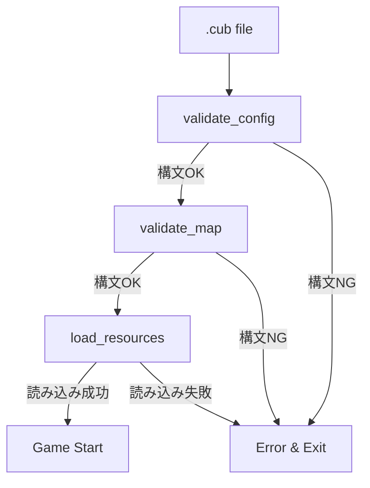

# Parser Module Design

## Overview

Parseモジュールは**.cubファイルの構文検証のみ**を担当する。
メモリ確保やリソース読み込みは行わず、フォーマットが正しいかを判定するだけ。



## Responsibility Separation

### Parse Module（このモジュール）: 構文検証のみ

各パーサーは**検証のみ**を行う:

- **validate_config**
  - 識別子（NO, SO, WE, EA, F, C）が6つ揃っているか検証
  - 識別子の重複チェック
  - RGB値が0-255の範囲内か検証
  - パス文字列が`.xpm`で終わるか検証
  - **ファイルの実在確認はしない**
  - **メモリ確保はしない**

- **validate_map**
  - マップが壁で囲まれているか検証
  - プレイヤー開始位置が1つだけあるか検証
  - 無効な文字が含まれていないか検証
  - **マップデータの複製はしない**

### Load Module（別モジュール）: 値の確保・読み込み

パース成功後、別モジュールが実際のリソースを読み込む:

- テクスチャパス文字列を複製（strdup）
- テクスチャファイルを実際に開いて読み込み
- マップ配列をメモリ確保してコピー
- RGB値を構造体に格納

## Layout Relationship

```
-----
Config Zone (validate_config で検証のみ)
-----
-----
Map Zone (validate_map で検証のみ)
-----
```

## Config Format

### Direction Texture
```
Identifier ./path_to_direction_texture
```

### Floor / Ceiling Color
```
Identifier R,G,B
```

### Identifiers
- North: `NO`
- South: `SO`
- West: `WE`
- East: `EA`
- Floor: `F`
- Ceiling: `C`

## What Parse Module Does NOT Do

❌ **メモリ確保**: malloc, strdup等は一切使用しない
❌ **ファイルI/O**: テクスチャファイルを開かない
❌ **データ保持**: パース結果を保持しない
❌ **リソース管理**: メモリ解放の責任を持たない

## What Parse Module DOES

✅ **構文検証**: フォーマットが正しいかチェック
✅ **範囲検証**: 数値が有効範囲内かチェック
✅ **一意性検証**: 識別子が重複していないかチェック
✅ **完全性検証**: 必須要素が揃っているかチェック

## Error Handling

構文エラー時:
1. 標準エラー出力に`Error\n`とメッセージを表示
2. `-1`を返す
3. **メモリ解放は不要**（確保していないため）

## Design Benefits

### 1. 単一責任の原則
- Parse: 「正しいか」だけを判定
- Load: 「値を確保」だけを担当

### 2. テスト容易性
- 検証ロジックを独立してテスト可能
- メモリ管理の複雑さがない

### 3. エラーハンドリング簡潔化
- パース失敗時にメモリリークの心配がない
- エラー時の後始末が不要

### 4. 再利用性
- 検証ロジックを別の文脈でも使用可能
- 構文チェックツールとして独立

## Example Usage

```c
// Phase 1: Parse（構文検証のみ）
char **lines = read_file("map.cub");
if (validate_cub_file(lines) != 0)
{
    free_lines(lines);
    return (ERROR);  // 構文エラー
}

// Phase 2: Load（値の確保・読み込み）
t_game game;
if (load_game_resources(lines, &game) != 0)
{
    free_lines(lines);
    return (ERROR);  // 読み込みエラー
}

free_lines(lines);  // 元データは不要

// Phase 3: Game（ゲーム実行）
run_game(&game);
```
