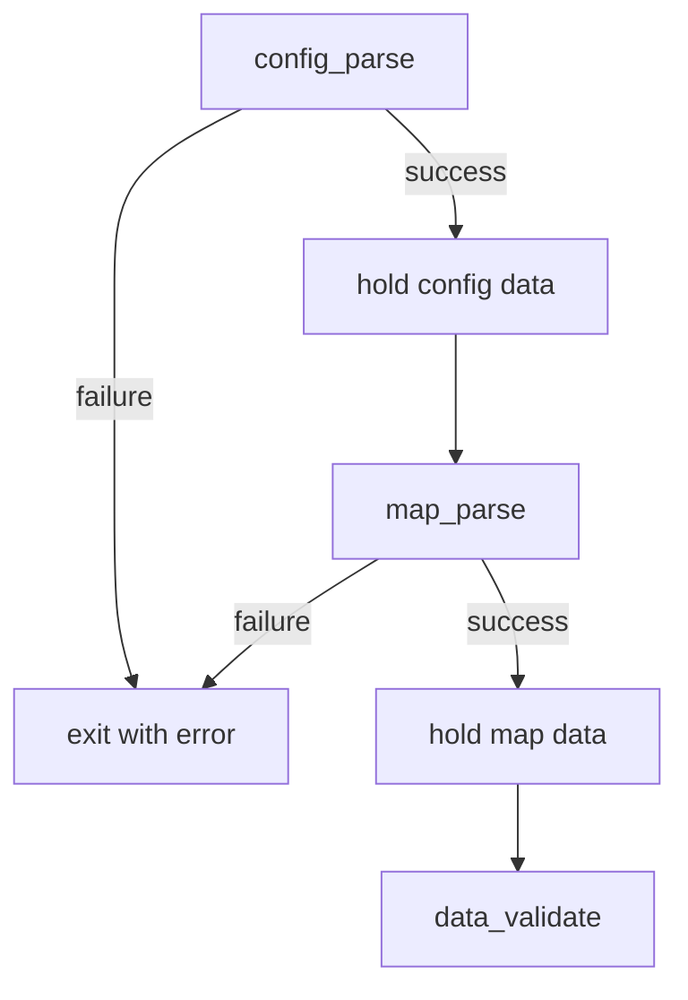

# Parser Module Design



## Overview

### What does the parser handle?
- **config_parse**
  - Validates the format of the configuration section only.
  - Ignores whether referenced file paths actually exist or are readable.
- **map_parse**
  - Validates the format of the map section.
- **Layout relationship**
  ```
  -----
  Config Zone
  -----
  -----
  Map Zone
  -----
  ```

### Direction Texture
```
Identifier ./path_to_direction_texture
```

### Floor / Ceiling Color
```
Identifier R,G,B
```

### Identifiers
- North: `NO`
- South: `SO`
- West: `WE`
- East: `EA`
- Floor: `F`
- Ceiling: `C`
- (Add door identifier if doors are implemented.)

### Unspecified in subject
- Handling unreachable empty spaces.
- Detailed policy for spaces inside the map.


## Error Handling
- On any misconfiguration, exit gracefully.
- Print `Error\n` followed by a precise error message describing the problem.
